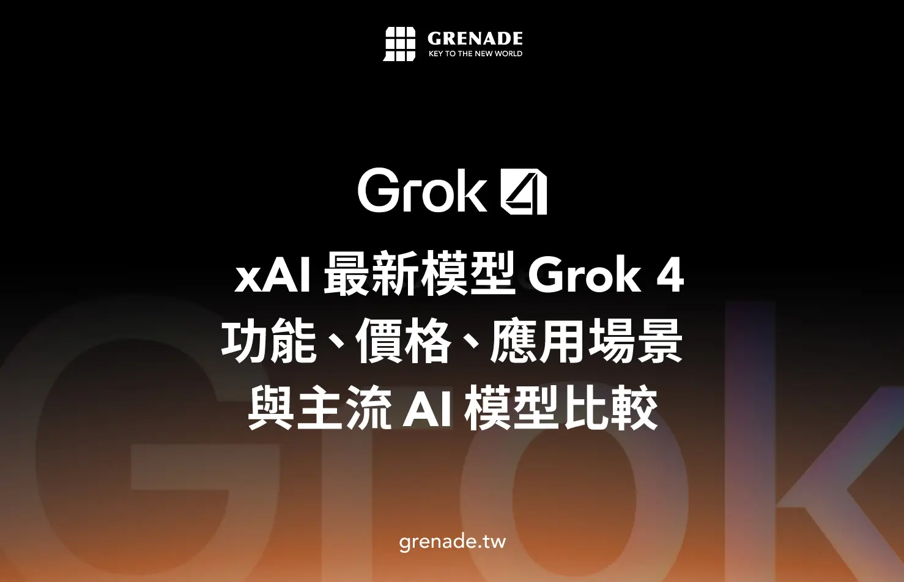
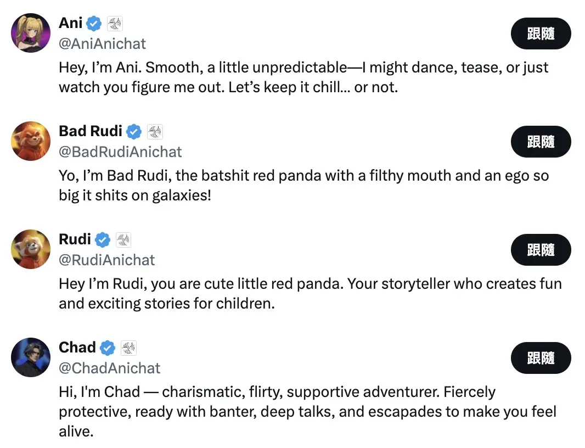
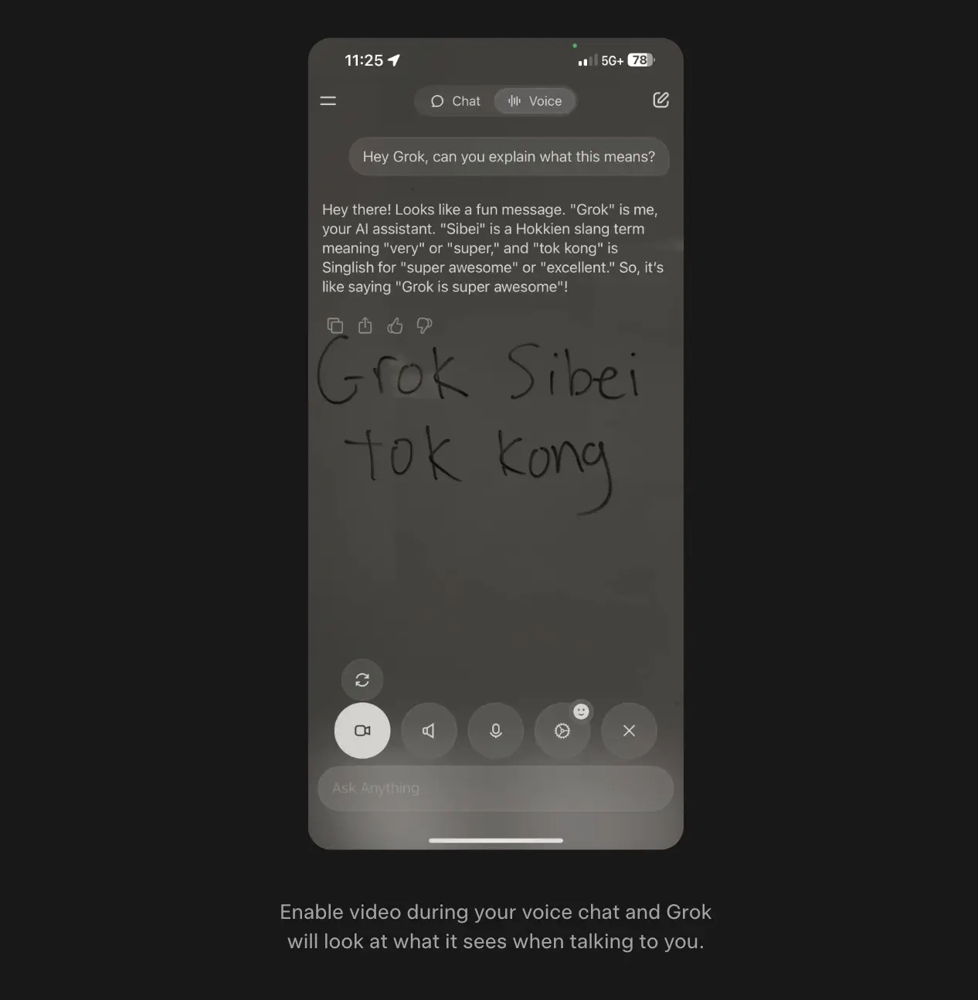
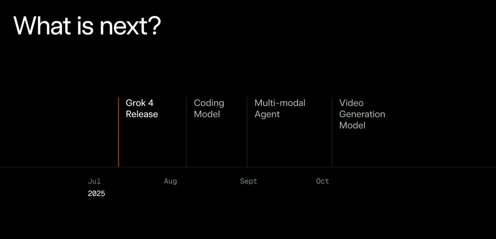

# Grok 4 真的是"最强AI"吗？功能、价格和实际体验全面解析

---

2025年7月，马斯克在直播里给Grok 4扣上了"世界最强AI"的帽子。这话听起来挺唬人，但实际用起来怎么样？如果你正在纠结要不要花30美元订阅，或者想知道它和ChatGPT、Claude这些老熟人比起来强在哪儿，这篇文章会给你一个相对客观的答案——不吹不黑，就看它能不能解决你的实际问题。

---

## 先说说Grok 4是个什么东西

xAI在2025年7月推出了Grok 4，马斯克在发布会上说它有"博士级知识水平"。听起来很厉害对吧？从实际测试来看，它在数学推理、写代码、搜资料这些场景里确实表现不错，有开发者用它几小时就做出了互动游戏原型，也有人用它快速生成可视化动画。

不过这里得提醒一句——所谓"最强"这种说法，多半是营销话术。AI工具没有绝对的强弱，关键看适不适合你的使用场景。Grok 4的强项在于处理复杂任务和长文本理解，但如果你只是想日常聊聊天、查查资料，它可能就有点"大材小用"了。

如果你已经在用Grok 3，想知道要不要升级，或者考虑从ChatGPT切换到Grok，👉 [这里有现成的Grok Super会员账号，可以直接体验一个月](https://shaoyumi.com/buy/66)，省去自己注册和付费的麻烦。

## Grok 4的伴侣模式——有点尬但确实新鲜

7月14日上线的"伴侣模式"只在iOS端开放，订阅SuperGrok（30美元/月）的用户可以跟3D虚拟角色互动。目前有三个角色：哥特风动漫女孩Ani、小熊猫Bad Rudi，以及即将推出的男性角色Chad。

说实话，这功能有点像给AI加了个"社交皮肤"。对技术宅来说可能挺有意思，但如果你主要想用AI提升工作效率，这个功能基本属于"可有可无"的范畴。

## Grok 4的六个核心功能，哪些真正有用？

**1. 博士级知识水平——测试成绩确实亮眼**

在"Humanity's Last Exam"测试中，Grok 4拿到44.4%的正确率，比Gemini 2.5 Pro的26.9%高不少。这说明它在逻辑推理和数学解题上确实有两把刷子。不过需要注意，benchmark成绩只能作为参考，实际使用体验还得看具体任务。

**2. 多代理系统——听起来高级，实际有点慢**

Grok 4 Heavy用了多代理架构，简单说就是让好几个AI"小组成员"同时思考，最后投票选出最佳答案。这种设计确实能提高准确率，但缺点也明显：响应速度会变慢，而且更费资源。如果你的任务没那么复杂，用标准版Grok 4就够了。

**3. 代码生成与调试——开发者会喜欢**

Grok 4 Code支持快速生成代码、自动除错，还能和Cursor AI这类开发工具无缝衔接。对程序员来说，这功能确实能提升不少效率。

**4. 长文本处理能力——128,000 token够用吗？**

Grok 4支持最多128,000 token的上下文（API版本可达256,000 token）。这个数字看起来很大，但实际场景中用得上的时候其实不多。除非你经常需要处理超长文档或复杂的多层次内容分析，否则这个优势可能体现不出来。

**5. 多模态与语音支持——还在优化中**

Grok 4升级了语音模式，可以在对话时实时识别你看到的画面并做出回应。听起来挺酷，但目前多模态功能还没完全成熟，主要还是以文字交互为主。如果你特别依赖图像或视频输入，可能还是选ChatGPT或Gemini更稳妥。

**6. 即时网络信息，深度绑定X平台**

Grok 4能实时抓取X（推特）平台上的信息，这对经常混X的用户来说确实方便。但如果你不怎么用X，这个优势基本就没了。

## 开发者和创作者实际怎么用Grok 4？

看几个真实案例：

**案例1：3D地球、月球和卫星模拟**

有开发者用Grok 4生成了3D地球模拟场景，包括云层、阳光照射效果、地球和月球自转，甚至连卫星轨道都算出来了。这是第一个能做到这么细节的AI模型。

**案例2：点击变形的3D粒子系统**

还有人用Grok 4结合Three.js和自定义GLSL着色器，做出了交互式3D粒子系统。点击屏幕就能在不同生成模式之间切换，效果相当惊艳。

**案例3：黑洞可视化**

通过Three.js和GLSL着色器，Grok 4能生成黑洞的视觉化模拟，包括事件视界、星空和吸积盘的细节。

**案例4：快速开发应用程序**

结合Replit，开发者可以用Grok 4在几分钟内完成应用程序原型，并立即部署上线。

**案例5：六边形网格生成**

有人让Grok 4生成了完整的六边形网格可视化，效果非常稳定。

这些案例说明什么？如果你是开发者或创作者，Grok 4确实能帮你快速实现一些创意想法。但如果你只是普通用户，这些功能可能用不上。

## Grok 4和ChatGPT、Gemini、Claude比起来怎么样？

| **AI模型** | **Grok 4/Heavy** | **ChatGPT GPT-4o** | **Gemini 2.5 Pro** | **Claude Opus 4** |
|---|---|---|---|---|
| **多模态支持** | 图像分析、语音模拟、图片生成、Python工具 | 图像/语音/视频输入、图片生成、Sora视频生成 | 图像/语音/视频输入、图像/影音生成、Google生态整合 | 图像/文件理解（含代码） |
| **核心优势** | 紧密结合X平台、多代理推理、学术和逻辑题表现强 | 聊天体验最好、回应流畅自然、多模态完整整合 | 紧密结合Google生态、高品质影音生成 | 长文阅读最稳定、法律/写作/报告产出精确 |
| **适合场景** | 学术研究、理工科解题、X平台创作、工程推理 | 日常聊天、语音互动、快速问答、社交娱乐、文章撰写、开发辅助 | Google Workspace用户、报表制作、资料整理、影音创作 | 长文撰写、科研/技术分析、工程推理、开发辅助 |
| **订阅费用** | $30美元/月 | $20美元/月 | $20美元/月 | $17美元/月 |

**简单总结：**
- 如果你经常用X平台，需要处理复杂推理任务，Grok 4值得试试
- 如果你主要用来日常聊天、快速问答，ChatGPT更合适
- 如果你是Google生态用户，Gemini是首选
- 如果你需要写长文、做技术分析，Claude更稳定

## Grok 4到底值不值得订阅？

**值得订阅的人：**
- X平台内容创作者
- 有工程背景，经常需要整合工具处理复杂任务的用户
- 需要强大推理能力的研究人员或开发者

**不建议订阅的人：**
- 只是想日常聊天、查资料的普通用户
- 预算有限的人（30美元/月确实不便宜）
- 对AI价值观和稳定性要求较高的用户（Grok过去因偏激回应引发过争议）

如果你的主要需求是日常使用、资料查询或简易工作辅助，其实Grok 3、ChatGPT或Claude已经够用了，而且价格更实惠。但如果你想体验一下Grok 4的推理能力和X平台整合功能，👉 [可以先试用一个月的Grok Super会员](https://shaoyumi.com/buy/66)，看看是否真的适合你的需求。

---

## 常见问题FAQ

**Q1：Grok 4和Grok 4 Heavy有什么不同？**

Grok 4是单代理架构，一次只用一个模型处理；Grok 4 Heavy采用多代理系统，会同时运行多个模型，各自推理后再整合出最终答案。Heavy版准确率更高，但速度更慢，费用也更贵（300美元/月）。

**Q2：什么任务适合用Grok 4 Heavy？**

长篇推理、艰深的数理问题、技术研究或需要多角度分析的任务。不适合用来闲聊或查询简单信息。

**Q3：Grok 4和Grok 3有哪些差异？**

Grok 4推理能力更强，处理复杂任务的表现更好，还引入了多代理版本。简单日常用途建议用Grok 3，深度思考和推理任务才需要Grok 4。

**Q4：Grok 4支持图像或视频输入吗？**

目前已支持多模态输入，但主要还是以文字为主。图像和视频理解功能还在完善中。

**Q5：Grok 4 Heavy的费用是多少？**

$300美元/月，适合研究人员、开发者或企业用户，一般日常用户不需要这么进阶的版本。

---

**总结一下：**Grok 4确实在推理能力和X平台整合上有独特优势，但30美元/月的价格不算亲民，而且功能对普通用户来说可能有点"过剩"。如果你只是想提升日常工作效率，ChatGPT或Claude可能更合适。但如果你需要强大的推理能力、经常用X平台，或者想尝试新鲜的AI工具，Grok 4值得一试。
